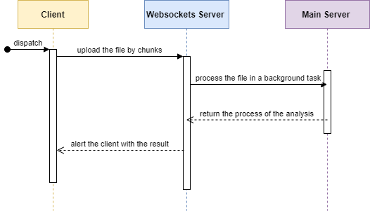

# csv-api

### Intro
An API for processing CSV files. This was originally submitted for a job interview screening process.

### Running-The-Project
- Clone the repo
- Open the directory `csv-api` in the terminal
- Install all the requirements
```pip install -r requirements.txt```
- Run the server
```uvicorn app.src.main:app --reload```

### Executing-Tests
While the API server is running, do the following to execute the tests:
- Open the directory `csv-api\app\tests` in a new terminal
- run the testing package 
```pytest -s```


## Step 2
To avoid the request timing-out, we could have the client continuously "polling" the server to check for updates. 
However this wastes resources on the server and require more hassle on the clientside. 
A better solution would be implementing a real-time bi-directional connection using sockets. WebSocket would allow for keeping
the connection open as much as needed for both the server and the client. Another feature from FastAPI that could 
be helpful in our usecase is `BackgroundTasks` which I encountered on [the official documentation](https://fastapi.tiangolo.com/tutorial/background-tasks/#using-backgroundtasks).

The following diagram illustrates one way we could use websockets and FastAPI's backgraound tasks in our usecase:


